## Layer 1 — Ingestion (collecting feedback)

**Technology: FastAPI (Python) endpoints**

Each feedback source is its own independent module. Your backend exposes simple API endpoints that accept data and save it to the database. You don't need to build all sources at once — start with manual upload, add others over time.

**Sources and how to integrate them:**

- **Manual upload / paste** — a simple text area or CSV uploader on your frontend that calls your FastAPI endpoint. Easiest starting point.
- **Slack** — use the [Slack Bolt SDK for Python](https://slack.dev/bolt-python). It listens to events (messages in specific channels) and forwards them to your backend.
- **Email** — use Mailgun or Postmark's inbound email feature. They give you a webhook URL — any email sent there gets forwarded as a JSON payload to your backend.
- **GitHub Issues** — use GitHub Webhooks. When an issue is created/commented, GitHub sends a POST request to your backend.

Every source converts its data to the **same internal JSON format** before saving it. This is the key to keeping sources modular and swappable.

---

## Layer 2 — Storage

**Technology: Supabase (free tier)**

Supabase gives you PostgreSQL + a built-in vector extension called `pgvector` + authentication + a REST API — all for free. It's the best single tool for this project because it replaces four separate things.

**What you store:**

- Raw feedback items (text, source, timestamp, metadata)
- Embeddings of each feedback item (vectors, stored in pgvector) — used for clustering
- Generated documents: BRD, PRD, epics, stories, tasks
- Ticket status and integration links

Since everything goes through Supabase, you can later swap any other layer without touching storage.

---

## Layer 3 — AI Pipeline

**Technology: OpenAI API (GPT-4o) + FastAPI**

This is the core of your product. Each pipeline step is its **own FastAPI route** (`/cluster`, `/generate-brd`, `/generate-stories`, etc.) that takes a JSON input and returns a JSON output. This keeps steps independent and easy to test or replace.

**Step by step:**

- **Clustering (Steps 1-2)** — Use OpenAI's `text-embedding-3-small` model to convert each feedback item into a vector. Then use simple cosine similarity queries against pgvector to find similar items. Group them into clusters. You don't need any ML library for this — pgvector handles the math via SQL.
- **BRD + PRD generation (Steps 3-5)** — Pass a cluster summary to GPT-4o with a well-crafted system prompt telling it to output a structured BRD in JSON format. Do the same for PRD separately. Using JSON output mode from OpenAI means you get clean, structured data every time — no parsing headaches.
- **Epic + Story generation (Steps 6-7)** — Feed the PRD into another GPT-4o call. Prompt it to return an array of epics, each with an array of user stories in Agile format.
- **Task breakdown + sprint plan (Steps 8-9)** — Feed each story into another call. Prompt it to return frontend tasks, backend tasks, testing tasks, estimated complexity, and dependencies.

**The human review gate** — before anything touches Jira or GitHub, your frontend shows the AI output for a human to review, edit, or reject. This is not just a nice feature; it's what makes the product trustworthy. Implement this as a simple approval table in your dashboard.

---

## Layer 4 — Integrations (pushing tickets)

**Technology: Official REST/GraphQL APIs (Python `requests` library)**

Each integration is its own Python module in your backend. They all receive the same approved task JSON and translate it to the target platform's format.

- **Jira** — [Jira REST API v3](https://developer.atlassian.com/cloud/jira/platform/rest/v3/intro/). Create issues with `POST /rest/api/3/issue`. You can set summary, description, priority, labels, and assignee. Use an API token (simple, no OAuth needed for personal/team use).
- **GitHub Issues** — [GitHub REST API](https://docs.github.com/en/rest/issues). `POST /repos/{owner}/{repo}/issues`. Super simple — title, body, labels, assignees.
- **Linear** — [Linear GraphQL API](https://developers.linear.app/docs). Slightly more complex because it uses GraphQL, but the docs are excellent.

Each integration is a separate file. Swapping one out (say, replacing Jira with Notion) means editing one file, not the whole project.

---

## Layer 5 — Frontend

**Technology: Next.js + Tailwind CSS**

Next.js gives you React with file-based routing, and it's easy to deploy on Vercel for free. Tailwind handles styling without writing custom CSS.

**Key pages to build:**

- **Feedback inbox** — shows all ingested feedback, grouped by cluster. Users can view, merge, or dismiss clusters.
- **Pipeline view** — a step-by-step visual showing what stage each cluster is at (clustered → BRD generated → review → tickets created).
- **Review page** — shows AI-generated BRD, PRD, stories, and tasks side by side. Let the user edit inline before approving.
- **Integrations settings** — a simple form to enter Jira/GitHub/Linear API keys and map epics to projects.

---

## How to keep everything modular

The single most important rule: **every layer communicates via JSON over HTTP.** Your frontend calls your FastAPI backend. Your FastAPI backend calls the OpenAI API, Supabase, and integration APIs. No layer imports code from another layer directly. This means you can:

- Replace OpenAI with Anthropic Claude by changing one file
- Replace Supabase with a regular PostgreSQL instance by changing the DB module
- Add a new ingestion source (like Discord) without touching anything else
- Add a new integration (like Notion) by writing one new Python file

---

## Extra ideas that would genuinely set this apart

These are real, achievable additions — not fluff:

**Confidence scores** — show a score (0–100) next to every AI-generated output. If the cluster has only 2 feedback items, show a low confidence score. This builds user trust and tells PMs when to double-check the AI's work.

**Feedback loop / training log** — when a human edits an AI-generated story during review, log the original and the edited version. Over time, use these examples as few-shot examples in your prompts. The product gets better the more it's used.

**Export before publish** — let users export the full BRD/PRD/stories as a Markdown or PDF file before any tickets are created. This is hugely useful for teams that need approvals before dev work starts.

**Slack bot interface** — a simple Slack slash command (`/pipeline run`) that triggers the full pipeline and posts the results in a channel for team review. This removes the need to even open your dashboard for quick tasks.

**Priority matrix view** — a 2×2 chart (frequency vs. impact) that plots each feedback cluster. High frequency + high impact = top of sprint. This makes prioritization visual and defensible.

---

## Recommended build order

Start small. Build one complete vertical slice before expanding horizontally.

1. Manual text upload → Supabase storage → GPT-4o generates user stories → display on a basic Next.js page. This alone is a working demo.
2. Add clustering with embeddings.
3. Add BRD and PRD generation.
4. Add the human review gate.
5. Add one integration (GitHub Issues is the easiest).
6. Add more ingestion sources.
7. Add the extra features above.

Each stage is independently useful and shippable. You never need to build everything at once.